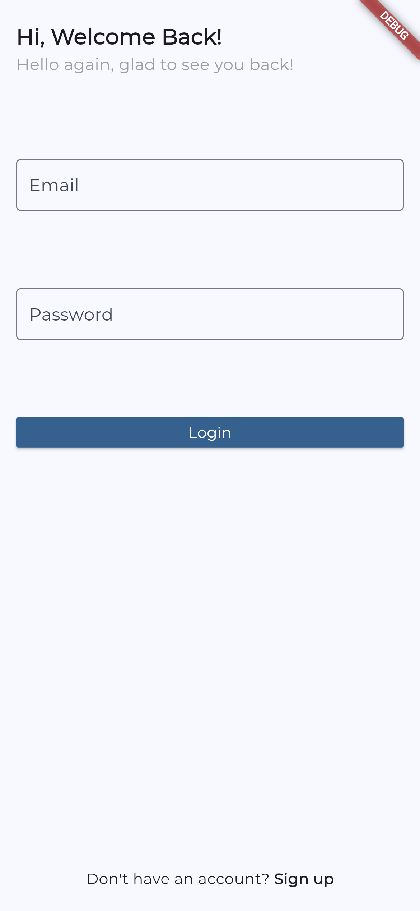
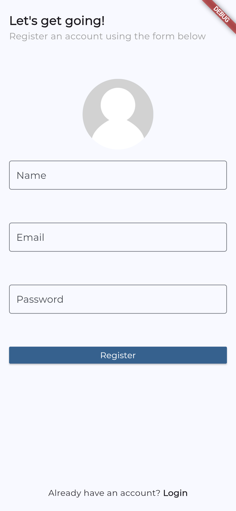
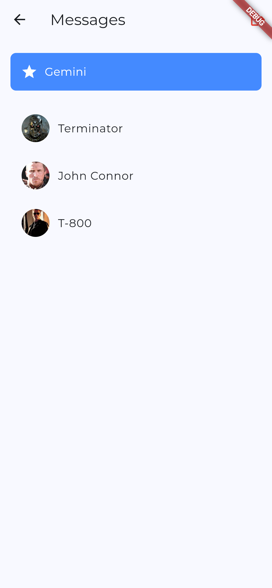
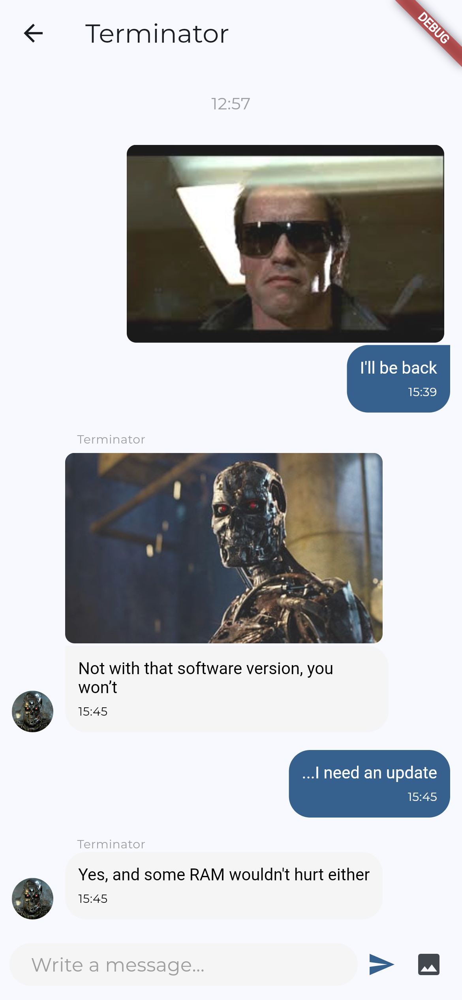

## SKYNET - Real-Time Chat Application

Skynet is a real-time chat application built with Flutter, utilizing the DashChat package for a seamless messaging experience. This app leverages Firebase for authentication, data storage, and analytics, providing a robust backend for managing user interactions. Additionally with the Gemini API, users can interact with both text and images, adding an extra layer of functionality and engagement.

## Features

- **Instant Messaging**: Effortless real-time conversations using DashChat.
- **Gemini API Integration**: Interact with text and images for enhanced communication through Gemini.
- **User Authentication**: Secure user login and registration with Firebase Authentication.
- **Cloud Storage**: Store and manage images and files with Firebase Storage.
- **Data Management**: Utilize Firestore for real-time data synchronization and storage.
- **Analytics**: Track user engagement and app performance with Firebase Analytics.
- **Cross-Platform Support**: Runs smoothly on Android, iOS, and more.
  
## Sample Screenshots

Here are some screenshots of the application in action:

    
    
    
    
    

## Conclusion

Skynet combines real-time messaging with modern features like Gemini API integration, making it more than just a chat app. With a clean, customizable interface and secure backend powered by Firebase, Skynet provides a strong foundation for further development and features.
